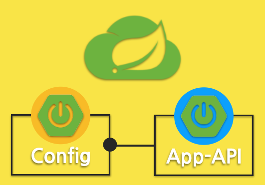
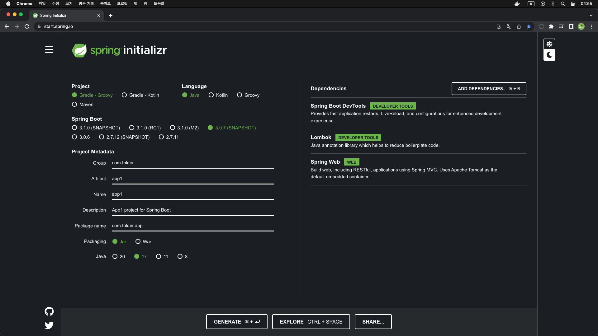

# DevConfig
DevContainer + Spring Cloud Config

### Architecture
</img>

### Spring App initializr

#### - App1
</img>

### Cloud Config initializr

#### - Server
</img>

#### - Client
</img>

### Spring Project
> * [Spring initializr](https://start.spring.io/)
> * [Application Properties](https://docs.spring.io/spring-boot/docs/current/reference/html/application-properties.html)

> * [Cloud Config](https://spring.io/projects/spring-cloud-config)
> * [Cloud Config Docs](https://docs.spring.io/spring-cloud-config/docs/4.0.3-SNAPSHOT/reference/html/)

----
### YouTube Link

